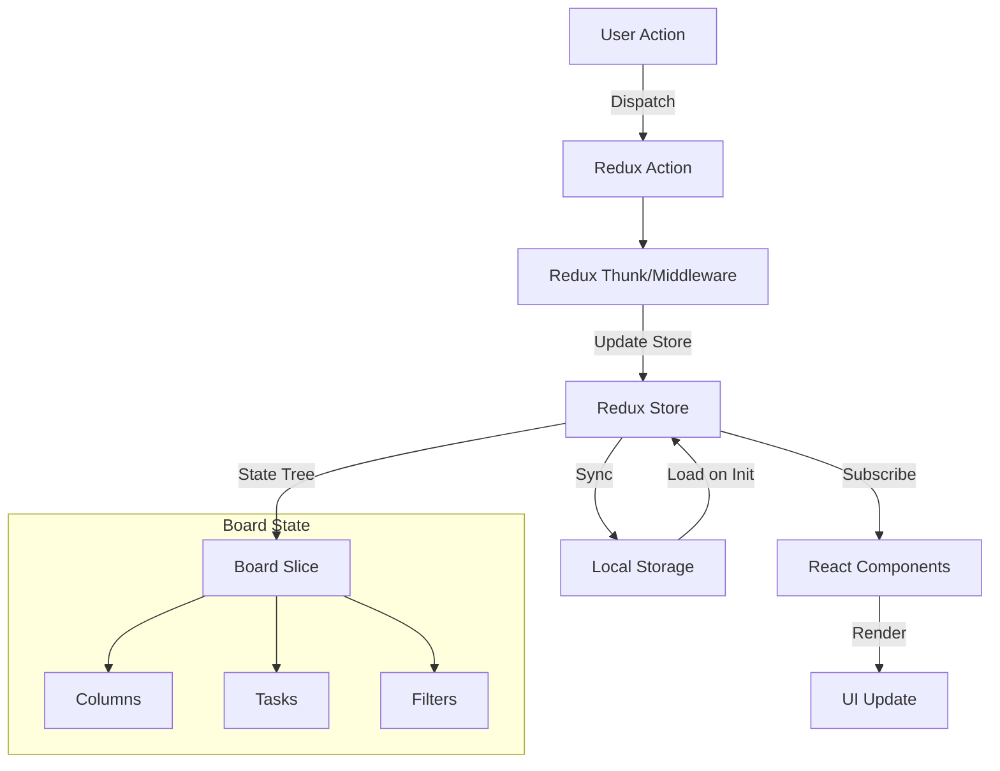

# Trello-Style Kanban Board

A modern, responsive Kanban board application built with Next.js, Redux Toolkit, and Tailwind CSS. Features drag-and-drop functionality, real-time updates, and a clean, intuitive interface.

## 🚀 Setup Instructions

1. **Clone the repository**
   ```bash
   git clone <repository-url>
   cd trello-kanban-board
   ```

2. **Install dependencies**
   ```bash
   # Using npm
   npm install --legacy-peer-deps

   # Using yarn (recommended)
   yarn install
   ```

3. **Run the development server**
   ```bash
   # Using npm
   npm run dev

   # Using yarn
   yarn dev
   ```

4. **Open the application**
   Navigate to [http://localhost:3000](http://localhost:3000) in your browser.

## 🏗️ State Architecture

The application uses Redux Toolkit for state management, implementing a centralized store pattern. Local storage synchronization ensures persistence across sessions.

### State Flow Diagram



### State Structure

```typescript
interface BoardState {
  tasks: {
    [id: string]: Task;
  };
  columns: {
    [id: string]: Column;
  };
  columnOrder: string[];  // Maintains column ordering
  filters: {
    assignee: string | null;
    priority: string | null;
  };
  history: BoardState[];  // For undo/redo functionality
  historyIndex: number;
}

interface Task {
  id: string;
  title: string;
  description?: string;
  priority: "High" | "Medium" | "Low";
  assigneeId: string;
  columnId: string;
  createdAt: string;
  updatedAt: string;
}

interface Column {
  id: string;
  title: string;
  taskIds: string[];
  color: string;
}
```

### Key Features

1. **Centralized Store**: All application state is managed in a single Redux store
2. **Persistence**: State is automatically synchronized with localStorage
3. **Optimistic Updates**: UI updates immediately while actions process
4. **Type Safety**: Full TypeScript support throughout the state layer
5. **History Management**: Built-in undo/redo functionality with state snapshots
6. **Ordered Columns**: Maintained column order for consistent layout
7. **Task Prioritization**: Support for High/Medium/Low priority tasks

### State Management Decisions

- **Why Redux Toolkit?**
  - Simplified Redux setup with built-in immutability
  - Powerful DevTools integration
  - Efficient performance with automatic memoization
  - Built-in TypeScript support

- **Why Local Storage?**
  - Offline capability
  - Instant loading of previous state
  - No backend dependency for MVP

- **Why Include History?**
  - Supports undo/redo operations
  - Limited to last 50 states to manage memory
  - Enables user confidence in making changes

## ⚠️ Known Issues & Tradeoffs

1. **Deprecated Dependencies**
   - `react-beautiful-dnd` is currently deprecated
   - Future migration to `@hello-pangea/dnd` or `@dnd-kit/core` recommended

2. **Local Storage Limitations**
   - 5-10MB storage limit varies by browser
   - No real-time collaboration support
   - Data exists only in browser
   - History storage may consume significant space

3. **Performance Considerations**
   - Large boards (100+ tasks) may experience slight drag lag
   - Initial load might be slower with large datasets in localStorage
   - History snapshots can impact memory usage with many tasks

4. **Browser Support**
   - Modern browsers only (IE not supported)
   - Requires JavaScript enabled
   - Local storage must be enabled

3. **Performance**
   - Implement virtual scrolling for large boards
   - Add service worker for offline support
   - Optimize state updates for large datasets
   - Implement lazy loading for history states
